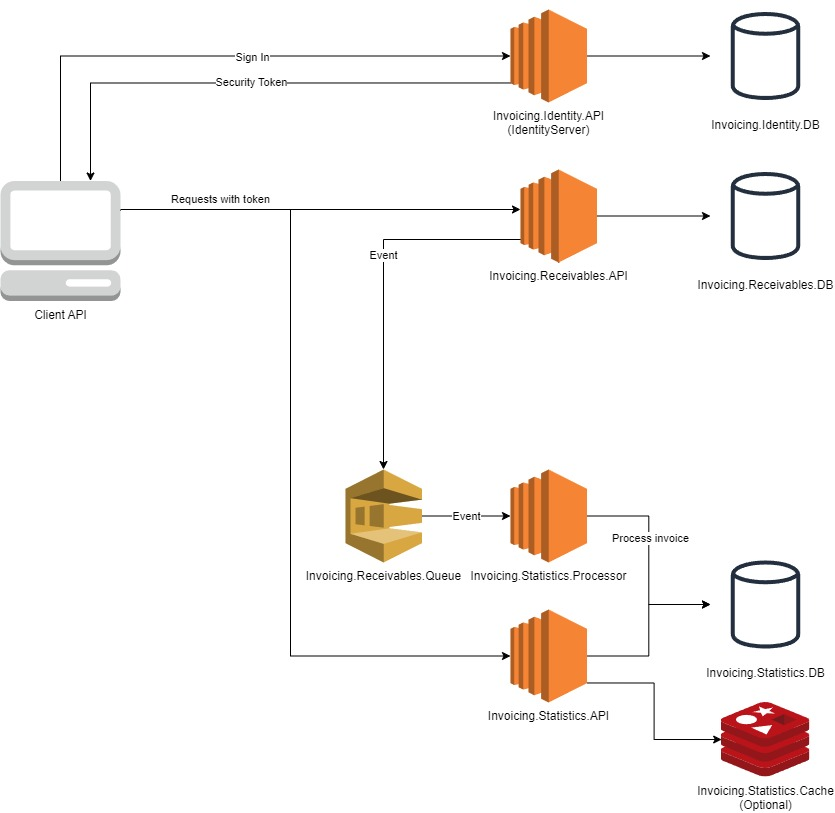

# About

TP24 Technical Test.

The architecture utilized is a variation of Clean Architecture combined with the CQRS pattern. Due to time constraints (and my bad planning), it requires some refactoring and adjustments. Initially, the intention was to prepare a larger solution containing cache/queues, as depicted in the diagram:



The current architecture consists of two separate APIs (Identity.API and the combination of Receivables.API with Statistics.API).

I have omitted several features I initially intended to implement, but the solution still includes functionalities for adding/getting receivables (invoices) and retrieving some basic statistics used to assess the company's health.

My next step would involve refactoring, such as extracting secrets, configs, enums and improving the structure of the function in StatisticsRepository. Additionally, I planned to integrate the Identity.API service (IdentityServer) with Receivables.API, allowing only authorized APIs to perform operations. As the application expands, performance tests will also be added.

# Getting Started

### Prerequisites

- ASP.NET Core Runtime 7.0.14 (.NET 7)
- Docker

Tested on Windows 11.

### Quickstart

1. Clone the repository

```
git clone git@github.com:oreze/tp24-invoicing.git
```

2. Run the desired service using docker-compose

```
cd tp24-invoicing/Invoicing
docker-compose -f .\docker-compose.receivables.development.yaml up
docker-compose -f .\docker-compose.identity.development.yaml up
```

3. Services will be available at these links

    [Identity.API](http://localhost:5001/.well-known/openid-configuration)

    [Receivables.API](http://localhost:5000/swagger/index.html)


### Testing:

1. Run system-tests docker-composes

```
docker-compose -f .\docker-compose.receivables.development.yaml up
docker-compose -f .\docker-compose.identity.development.yaml up
```

2. Run this command in each test project (IntegrationTests/UnitTests)

```
dotnet test -e ASPNETCORE_ENVIRONMENT=SystemTests
```

3. Enjoy green tests!

### Example flow:

1. Create invoice with this payload:

```
{
  "reference": "INVOICE - #123213",
  "currencyCode": "USD",
  "issueDate": "2023-06-12T19:17:48.572Z",
  "openingValue": 2169.03,
  "paidValue": 2169.03,
  "dueDate": "2023-12-27",
  "debtorName": "Kenneth Ross",
  "debtorReference": "c6a47a2c-2fc3-437b-9b0e-dfbd814a3f16",
  "debtorAddress1": "122 Maple Street",
  "debtorAddress2": "Apt 34",
  "debtorTown": "Port Jefferson",
  "debtorState": "NY",
  "debtorZip": "11777",
  "debtorCountryCode": "US",
  "debtorRegistrationNumber": "AA1234567891AA"
}
```

2. Retrieve invoice with received ID

3. Retrieve any statistic
